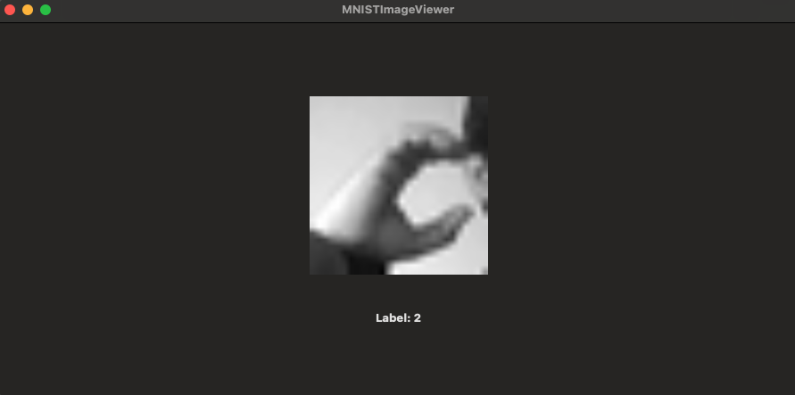

# MNIST Image Viewer

This project is a SwiftUI application that reads and displays images from the MNIST-like dataset, specifically for sign language gestures. The app uses a CSV file (`sign_mnist_train.csv`) to load the pixel data and visualizes it on the screen.

## Example Image
Below is an example of the application displaying an image from the dataset, with the corresponding label:

In this example, the label for the image is **2**, representing the gesture captured.

## Features
- Loads pixel data from a CSV file and displays it as a 28x28 grayscale image.
- Allows for hardcoded selection of different images from the dataset.
- Displays the corresponding label for each image.

## How to Use
1. Clone the project and open it in Xcode.
2. Add the CSV dataset (`sign_mnist_train.csv`) to the project.
3. Update the `currentIndex` value in `ContentView.swift` to display different images from the dataset.
4. Run the app to view the selected image.

## Requirements
- Xcode 12 or later
- Swift 5
- macOS 11 or later

## License
This project is licensed under the MIT License.
